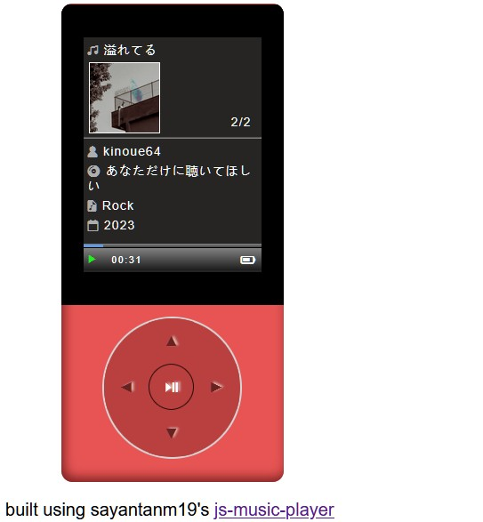
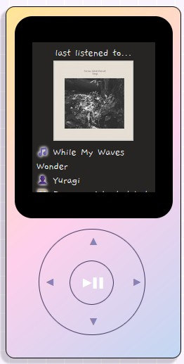
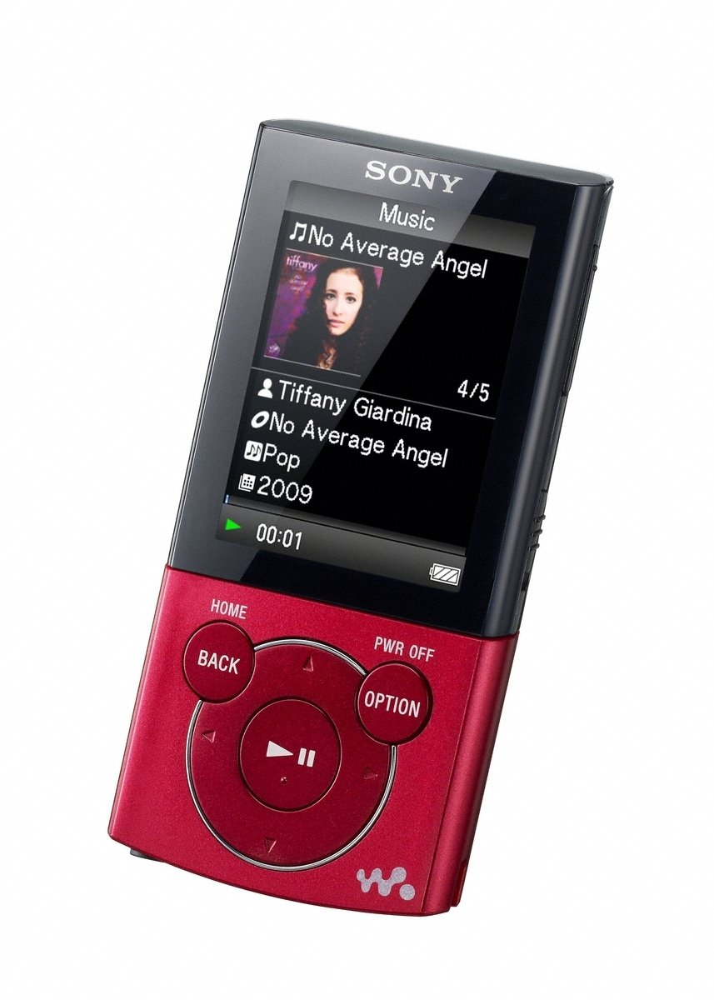

# JS walkman mp3 player (WIP)

functional JS music player with the looks of one of those sony walkman mp3 players.

the overall CSS will most likely be the same as the [last.fm widget](https://github.com/biancarosa/lastfm-last-played) i designed for my homepage but i would like it for the UI to be more accurate to the mp3 players around 2008.

my fun little summer project.

### to-do's / ideas

- [ ] screen for playlist menu
- [ ] make time blink when song is paused
- [x] screen for currently playing song
